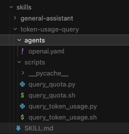

# Skills 目录结构与 `SKILL.md` 说明

本文约定与 **Codex / Claude Code / Cursor** 等环境的 skill 目录习惯对齐，并说明 **uni-agent** 如何加载与使用。

---

## 1. 顶层布局

所有 skill 放在配置项 **`UNI_AGENT_SKILLS_DIR`**（默认仓库下 `skills/`）中。**仅扫描该目录下一层子目录**；每个子目录对应 **一个** skill，目录名通常与 skill 名称一致（也可由 `SKILL.md` frontmatter 的 `name` 覆盖）。

示意目录树（与常见项目布局一致）：

```text
skills/
├── general-assistant/          # 示例：仅 skill.yaml + entry 文案（旧式 manifest）
│   ├── skill.yaml
│   └── prompt.md
│
└── your-skill-name/            # 示例：Codex / Cursor 风格（SKILL.md 为主）
    ├── SKILL.md                # 必填（本模式下）：frontmatter + 正文
    ├── skill.yaml              # 可选：与 SKILL.md 并存时用于补全版本、allowed_tools 等
    ├── agents/                 # 可选：给其他客户端（如 Codex）的元数据；uni-agent 当前不解析
    │   └── openai.yaml
    ├── scripts/                # 可选：可执行脚本（shell / python 等）
    │   ├── helper.sh
    │   └── helper.py
    ├── references/             # 可选：补充 Markdown，可被加载器发现
    │   └── detail.md
    ├── reference.md            # 可选：根级参考文档（与 references/ 二选一或并存）
    └── examples.md             # 可选：示例说明
```

说明：

| 路径 | 作用 |
|------|------|
| `SKILL.md` | 主说明文件：YAML 头 + Markdown 正文；无此文件时可用 `skill.yaml` + `entry` 指向的 md 代替。 |
| `skill.yaml` | 旧式清单；若与 `SKILL.md` 同目录，用于 **合并** 元数据（如 `version`、`allowed_tools`、`triggers`）。 |
| `scripts/` | 供规划器在提示中列出路径；执行时通过 `shell_exec`，**工作目录为 workspace 根**，路径多写 `skills/<skill>/scripts/...`。 |
| `references/`、`reference.md`、`examples.md` | 补充文档；小文件可被 **内联** 进加载器生成的 `instruction_text`，否则仅列出路径供 `file_read`。 |
| `agents/` | 外部工具链配置（如 OpenAI/Codex 侧）；**uni-agent 运行时忽略**，可保留便于同源复制 skill。 |

勿将 `__pycache__`、`.pyc` 等产物当作 skill 契约的一部分；若需提交仓库，建议在 `.gitignore` 中排除。

下图与本节文字树一致，展示某 skill（含 `agents/`、`scripts/`、`SKILL.md`）在 IDE 中的典型展开方式：



---

## 2. `SKILL.md` 文件结构

文件由两段组成：**YAML frontmatter**（夹在首行与第二个 `---` 之间）+ **Markdown 正文**（第二个 `---` 之后）。

### 2.1 最小模板

```markdown
---
name: your-skill-name
description: >-
  一句话说明技能做什么、在什么场景下使用（Codex 风格里这是主要「触发语义」来源）。
---

# 技能标题

## When To Use
…

## Workflow / Scripts
…
```

### 2.2 Frontmatter 常用字段（uni-agent 识别）

| 字段 | 必填 | 说明 |
|------|------|------|
| `name` | 建议 | Skill 标识；缺省时可用 **目录名**。 |
| `description` | 强烈建议 | 人类可读说明；**无 `triggers` 时** 会用于从描述中拆词做任务匹配。 |
| `version` | 否 | 版本字符串；默认 `0.0.0`。 |
| `triggers` | 否 | 字符串或字符串列表；任务文本 **子串命中** 时加分。 |
| `priority` | 否 | 整数，匹配排序基底分。 |
| `allowed_tools` | 否 | 允许使用的内置工具名列表；多 skill 选中时为 **并集** 再与注册表求交。 |
| `required_tools` | 否 | 声明依赖（当前以清单为主，执行策略可后续加强）。 |

多行 `description` 可使用 YAML 的 `>-` / `|` 折叠或字面块。

### 2.3 正文（Markdown body）建议章节

正文无强制 schema，为便于人和模型阅读，建议包含：

- **When To Use** / **Do Not Use**：边界清晰，减少误触发。
- **Inputs**：需要用户或上下文提供哪些参数。
- **Workflow**：步骤化说明。
- **Scripts**：脚本路径、示例命令行（相对 **workspace** 的路径，如 `skills/your-skill-name/scripts/foo.sh`）。
- **Output Format** / **Constraints**：输出形态与安全/接口约束。

首段 `---` … `---` **必须**合法 YAML；解析失败时 frontmatter 可能被丢弃，仅保留正文。

### 2.4 无 frontmatter 的退化

若文件 **不以** `---` 开头，整文件视为 **纯 Markdown 正文**；此时 `name` 等元数据由同目录的 `skill.yaml` 或 **目录名** 补全。

---

## 3. uni-agent 中的加载与使用要点

1. **发现**：每个 `skills/<dir>/` 含 `SKILL.md` 或 `skill.yaml` 即加载为一项 `SkillSpec`。
2. **合成 `instruction_text`**：正文 + 可选内联参考 + `scripts/` 路径说明；总长上限约 6 万字符（超出截断）。
3. **匹配**：`SkillMatcher` 对 `triggers` 与子串打分；**无 triggers** 时用 `description` 拆词辅助匹配。
4. **规划注入**：**仅 `PydanticAIPlanner`（LLM 规划）** 将选中技能的 `instruction_text` 写入用户提示；启发式规划不读长文。
5. **路径与安全**：`file_read` 仅能读 **workspace** 内路径；脚本常需 `bash`/`python3`/`curl`/`jq` 等，需在 **`UNI_AGENT_SANDBOX_ALLOWED_COMMANDS`** 中配置，或在 TTY 下 **一次性批准**。

更完整的模块职责见 [开发文档](./开发文档.md) §4.3。

---

## 4. 相关文档

- 交互客户端 + skill + 沙箱批准的正向流程（脱敏）：[cases/2026-04-15-interactive-client-skill-token-query-positive.md](./cases/2026-04-15-interactive-client-skill-token-query-positive.md)
