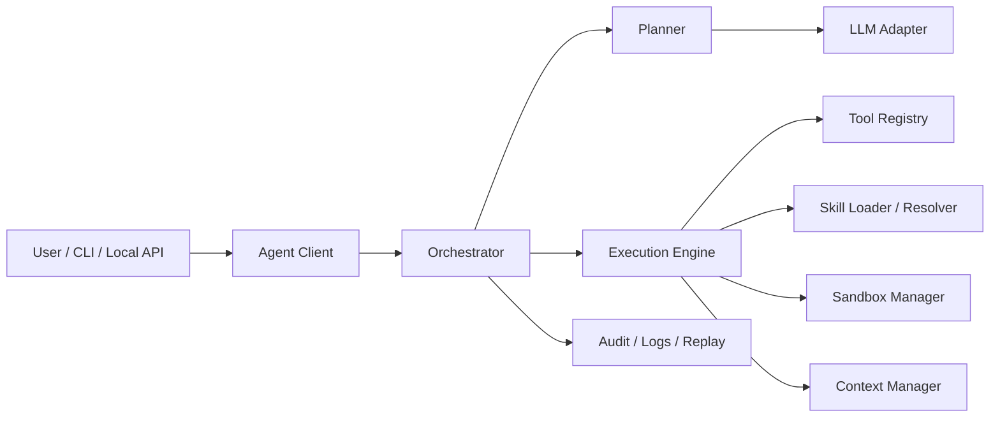

# 可插拔 Skills 通用 Agent Client 设计文档

## 1. 项目目标

本项目要做的不是通用 Agent 平台，而是一个通用 Agent Client。

这个 Client 的核心目标是：

- 提供一个本地或受控环境中运行的 Agent Runtime。
- 通过加载可插拔 Skills 扩展 Agent 能力。
- 通过统一工具接口和通用沙盒完成实际执行。
- 让同一个 Client 在不同 Skill 组合下适配不同任务场景。

一句话定义：

这是一个“可加载 Skills 的通用 Agent 客户端内核”。

## 2. 产品边界

### 2.1 In Scope

- 单机运行或单实例部署的 Agent Client
- 会话管理与任务执行
- 模型调用与工具调用
- 本地 Skill 加载、匹配、组合与执行
- 通用沙盒执行
- 基础日志、审计与回放
- CLI 或轻量本地服务接口

### 2.2 Out of Scope

- 多租户平台
- 复杂控制台后台
- 商业化计费
- 多节点调度平台
- Skill 市场和在线发布中心
- 多 Agent 网络编排系统
- **通用 MCP（Model Context Protocol）客户端**：不作为本期核心交付；工具能力以 **内置 ToolRegistry + 本地 Skill（脚本 / HTTP 等）** 扩展为主。若需对接特定服务，优先用现有 `http_fetch`、专用 skill 或少量硬编码工具，避免维护一层通用 MCP 适配。

## 3. 要解决的问题

普通 Agent 脚本通常存在这些问题：

- 指令和业务能力强耦合，难复用。
- 一旦任务换场景，就需要重写 Prompt。
- 工具调用方式不统一，执行链路不可控。
- 缺少安全边界，shell 和文件操作风险高。
- 很难沉淀“能力模块”并在后续任务里复用。

本项目希望通过 Client + Skills 的方式，把“通用能力”与“场景能力”分开：

- Client 负责运行时、工具调用、状态管理与安全执行。
- Skill 负责场景知识、约束、工作流提示与所需工具声明。

## 4. 可行性评估

### 4.1 结论

项目可行，而且比“做平台”更适合作为第一阶段目标。

原因很直接：

- 架构更收敛。
- 功能闭环更容易做出来。
- 安全边界更容易控制。
- 可以先验证 Skill 机制是否真的有效。

### 4.2 可行性依据

#### 技术可行

- 现有大模型已经支持结构化输出和工具调用。
- 本地受控 shell、文件系统限制、命令白名单等机制可以直接落地。
- Skill 可以采用插件式目录加载，不需要先做复杂中心化治理。
- CLI + 本地服务模式足以覆盖第一阶段场景。

#### 工程可行

- 首期只做单实例 Client，复杂度明显低于平台。
- 模块边界清晰，适合边开发边验证。
- 可以先支持少量基础工具和少量 Skills，快速形成闭环。

#### 产品可行

- 对于研发辅助、文档处理、代码修改、运维脚本等任务，Client 形态足够实用。
- Skill 的可插拔方式能让能力沉淀下来，而不是散落在 Prompt 中。

### 4.3 主要风险

#### 风险一：Skill 设计失控

表现：

- Skill 结构不统一。
- 依赖工具不明确。
- 不同 Skill 对同类任务给出冲突约束。

应对：

- 设计统一 Skill Manifest。
- 要求 Skill 明确声明触发条件、依赖工具和使用说明。
- 对 Skill 加载顺序和冲突策略做约束。

#### 风险二：Agent 规划不稳定

表现：

- 计划质量波动。
- 工具选择不稳定。
- 长任务执行容易偏航。

应对：

- 限制首期任务深度。
- 强制 Planner 输出结构化步骤。
- 对高风险工具增加策略校验。
- 对关键动作增加观察和重规划。

#### 风险三：本地执行安全问题

表现：

- shell 命令可能越权。
- 文件读写可能误改工作区。

应对：

- 使用通用沙盒执行器。
- 默认最小权限。
- 目录访问、命令执行、网络访问全部受控。
- 所有动作保留审计日志。

## 5. 核心设计原则

- Client 优先：先做好一个可靠的客户端内核，不追求平台化。
- Skill 优先：场景能力都通过 Skill 注入，不把逻辑散落到主流程里。
- 安全优先：默认最小权限，所有高风险动作必须可控。
- 可解释优先：计划、工具选择和执行结果都要能追踪。
- 可扩展优先：模型、工具、Skill、沙盒都要可替换。

## 6. 总体架构

## 7. 核心模块

与代码对齐的**运行流程与领域模型**摘要见：[Agent运行流程与领域模型.md](./Agent运行流程与领域模型.md)。

### 7.1 Agent Client Shell

职责：

- 作为客户端入口接收用户任务。
- 管理运行配置、会话、工作目录和输出格式。
- 提供 CLI 或本地 API 接口。

说明：

- 这里的“Client”是一个运行程序，不是平台网关。

### 7.2 Orchestrator

职责：

- 驱动一次任务从输入到完成的全流程。
- 管理 Plan -> Act -> Observe -> **Replan** 循环（失败或空计划时带 `prior_context` 再规划，受 `orchestrator_max_failed_rounds` 限制）。
- 控制超时、终止和错误恢复。
- **成功判定（当前实现）**：仅当累积 `plan` 中**每一步**均为 `completed` 时任务 `completed`；任一历史步骤 `failed` 则整单 `failed`（即使后续轮次已成功）。
- **流式可见性**：可选向回调推送事件（规划、每步结束、结论、结束），便于 CLI stderr NDJSON。
- **结论**：任务末尾生成 `conclusion`（规则摘要 + 可选 LLM），与 `output` / `plan` 一并落盘。

### 7.3 Planner

职责：

- 根据用户目标、当前上下文、已加载 Skills 和可用工具生成计划。
- 输出结构化步骤，而不是自由文本。

实现约定（当前仓库）：

- 规划阶段的**候选工具集合**为 **ToolRegistry 中的全部内置工具**，不因选中 Skill 或 `SkillSpec.allowed_tools` 而删减；Skill 通过长文说明（`instruction_text`）与匹配元数据影响**如何**选工具，而非**可否**见到某工具。
- 默认规划系统提示需引导模型在完整工具集上做出正确选择（见 `agent/system_prompts.py`）。

要求：

- 输出必须符合预定义 schema。
- 能识别何时需要启用某个 Skill（语义上依赖其说明与触发信息）。

### 7.4 Execution Engine

职责：

- 执行计划中的每一个动作。
- 负责调用工具、装配 Skill 上下文、处理结果和触发重规划。

要求：

- 统一 Action 执行接口。
- 统一错误结构与执行记录。

### 7.5 Skill Loader / Resolver

职责：

- 从本地目录扫描可用 Skills。
- 校验 Skill Manifest。
- 根据任务上下文选择适用 Skill。
- 处理多 Skill 组合、优先级与冲突。

建议 Skill 结构：

- `skill.yaml`：基础元数据
- `prompt.md`：行为约束和使用说明
- `tools.json`：依赖工具声明
- `examples/`：示例
- `tests/`：最小验证

### 7.6 Tool Registry

职责：

- 管理 Client 可调用的工具。
- 为模型提供工具清单和参数 schema（规划侧**始终**使用完整清单；与 Skill 组合方式无关）。
- 将请求路由到实际执行器。

建议首批工具：

- `file_read`
- `file_write`
- `shell_exec`
- `http_fetch`
- `search_workspace`

### 7.7 Sandbox Manager

职责：

- 在受控环境中执行 shell、文件和网络动作。
- 限制工作目录、命令、输出、时长和权限。

建议能力：

- workspace 白名单
- 命令白名单/策略拦截（默认白名单含常用只读/检索命令及 **`du`**，便于目录用量分析；可配置覆盖）
- **可选交互批准**：非白名单命令在交互终端可经用户确认后单次执行（非 TTY 默认拒绝）
- 超时终止
- 输出截断
- 文件变更记录
- 审计日志

### 7.8 Context Manager

职责：

- 管理当前会话上下文。
- 控制短期上下文注入和压缩。
- 将 Skill 说明与工具能力注入 Planner / Executor。

### 7.9 Audit / Replay

职责：

- 记录任务执行轨迹。
- 支持错误定位和行为回放。
- 为后续评测提供样本。

## 8. 核心执行流程

1. 用户通过 CLI 或本地接口提交任务。
2. Client 加载运行配置、工作目录、可用工具和 Skills。
3. Skill Resolver 根据任务筛选候选 Skills。
4. Planner 结合任务、上下文、Skills、工具生成结构化计划。
5. Execution Engine 在 Sandbox 中逐步执行动作。
6. 每一步结果回传给 Orchestrator，必要时触发重规划。
7. Client 输出最终结果，并记录日志与审计轨迹。

## 9. Skill 机制设计

### 9.1 Skill 目标

Skill 不是简单 Prompt 片段，而是面向场景能力的最小复用单元。

Skill 应至少包含：

- 适用场景描述
- 触发规则
- 行为约束
- 依赖与工具说明（如 `required_tools`；`allowed_tools` 可作自述，**不**替代运行时向规划器暴露的完整内置工具集）
- 示例和测试样例

### 9.2 Skill Manifest 建议字段

- `name`
- `version`
- `description`
- `triggers`
- `priority`
- `required_tools`
- `allowed_tools`（可选文档字段；运行时规划仍暴露全部内置工具）
- `entry`
- `tags`

### 9.3 Skill 选择策略

建议策略：

- 先按显式命中匹配
- 再按 tags / triggers 匹配
- 再按优先级排序
- 最后做冲突消解

### 9.4 Skill 冲突处理

建议规则：

- 同一类场景只允许一个主 Skill。
- 通用辅助 Skill 可与主 Skill 组合。
- 当两个主 Skill 冲突时，以显式指定优先。

## 10. 数据结构草案

### 10.1 Session

- `id`
- `workspace`
- `active_skills`
- `created_at`

### 10.2 Task

- `id`
- `session_id`
- `input`
- `constraints`
- `status`
- `result`

### 10.3 PlanStep

- `id`
- `type`
- `description`
- `tool`
- `skill`
- `input`
- `status`
- `depends_on`

### 10.4 SkillSpec

- `name`
- `version`
- `triggers`
- `required_tools`
- `entry_prompt`

## 11. MVP 范围

第一阶段只做一个可用的 Agent Client 闭环：

- CLI 入口
- 单会话任务执行
- 单模型接入
- 本地 Skill 加载
- 文件 / Shell / HTTP / Workspace Search 基础工具
- 本地受控沙盒
- 执行日志和回放

不做：

- 平台化任务中心
- 用户管理
- 多租户
- 在线 Skill 市场
- 分布式任务调度

## 12. 分阶段路线

### Phase 1：最小可用 Client

目标：

- 跑通 CLI -> Planner -> Tools -> Sandbox -> Result。

### Phase 2：Skill 可插拔完善

目标：

- 做好 Skill Manifest、扫描、匹配、冲突处理和验证。

### Phase 3：安全与可观测增强

目标：

- 补齐审计、回放、策略拦截和更细粒度沙盒控制。

### Phase 4：可扩展能力增强

目标：

- 增加更多工具类型、更多 Skill 组合能力和本地服务模式。

## 13. 最终判断

如果目标是“做一个可复用、可扩展、可控的通用 Agent 客户端”，这个项目是可行的。

正确方向不是先做平台，而是先做：

- 一个稳定的 Client Runtime
- 一套可插拔 Skill 机制
- 一个受控的工具执行沙盒

只要这三个核心点闭环，后面无论是扩展成本地产品、团队工具还是平台能力，都有基础。
